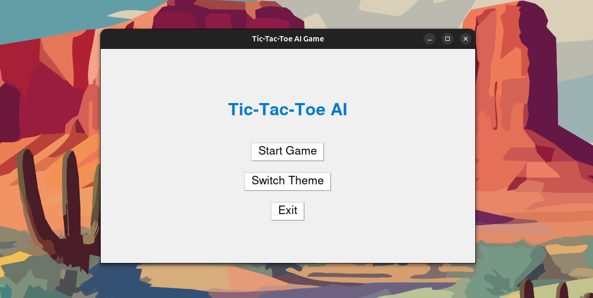

# 🎮 AI Tic-Tac-Toe GUI

A modern, AI-powered **Tic-Tac-Toe game** built with **Python** and **Tkinter**, featuring:

- 🧠 Reflex AI (Medium Difficulty)
- 🌗 Light/Dark Theme Switcher
- 🖥️ Beautiful Modern GUI
- 🐳 Docker Support
- 🔁 Restart & Main Menu Options

> ⚡ Version 2 — fully functional, beautiful UI with Reflex AI and theme toggle.

---

## 📸 Preview




---

## 🚀 Features

✨ Reflex AI: Fast and responsive  
🌙 Dark & ☀️ Light Mode Toggle  
🎨 Clean, modern UI (Tkinter)  
🔁 Play Again or Exit from Menu  
🪟 Cross-platform: Linux, Windows, macOS  
🐳 Easy Docker deployment  

---

## 🛠️ How to Use

### 🔁 Clone This Repository

```bash
git clone https://github.com/Snehashish12/ai-ttt-gui.git
cd ai-ttt-gui
```

### 🐳 Run with Docker (Recommended)
<br>

#### 1. Pull Docker Image

```bash
docker pull snehashish12/ai-ttt-gui:v2
```

#### 2. Run the Container

#### 📍 Linux
```bash
xhost +local:docker
docker run -it \
-e DISPLAY=$DISPLAY \
-v /tmp/.X11-unix:/tmp/.X11-unix \
--rm snehashish12/ai-ttt-gui:v2
```
#### 📍 Windows (Docker Desktop + X11 Server like VcXsrv)
```bash
docker run -it ^
-e DISPLAY=host.docker.internal:0.0 ^
--rm snehashish12/ai-ttt-gui:v2
```
#### 📍  macOS (with XQuartz)
```bash
xhost + 127.0.0.1
docker run -it \
-e DISPLAY=host.docker.internal:0 \
--rm snehashish12/ai-ttt-gui:v2
```
---
<br>


### 💻 Run Locally (Without Docker)
_Make sure Git Repository is pulled, if not follow above instruction to clone the git repository_

#### 1. Run the Container
```bash
python -m venv venv
source venv/bin/activate      # Windows: venv\Scripts\activate
```
#### 2. Install Requirements
```bash
pip install -r requirements.txt #tkinter-atleast for now
```
#### 3. Launch the Game
```bash
python3 main.py
```
---
<br>

## ❗Common Setup Issues
| Error |  Solution  |
|:------------|-------------:|
| tkinter not found  |Install via sudo apt install python3-tk (Linux) or brew install python-tk (macOS)|
|couldn't connect to display   |	Run xhost +local:docker before launching Docker|
|GUI not launching|Ensure X11 server is running properly|

---
<br>

## 📁 Project Structure
```bash
├── main.py                 
├── Dockerfile             
├── requirements.txt       
├── README.md              
├── assets/                  

```
<br>

## 💡 What’s Coming Next?
* 🔮 Minimax AI Mode
* 🧠 Reinforcement Learning AI
* 🎯 Difficulty Selector
* 📈 Match Stats + Scoreboard
